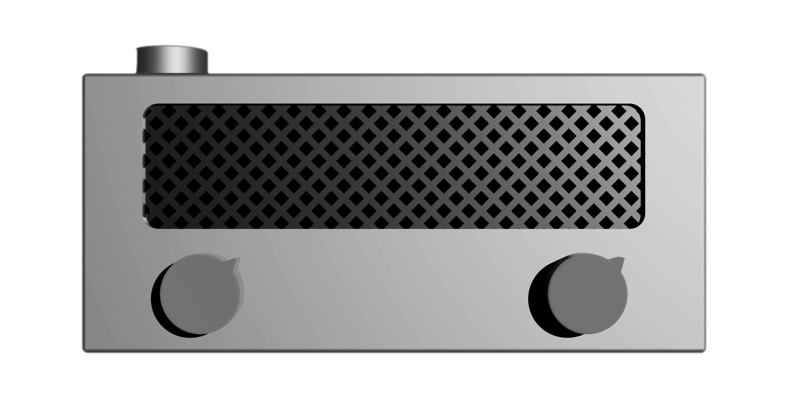
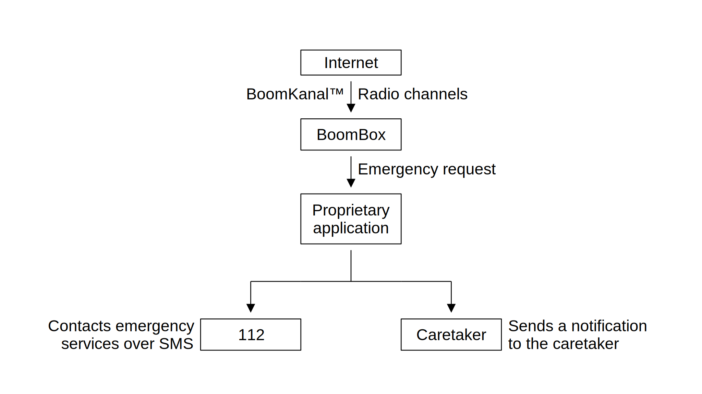
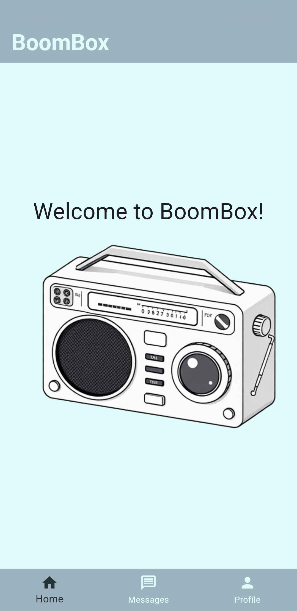

# BoomBox
### Developed by IBS
#### SDU Hackathon '24      

 
Bringing the World to Your Ear - One Word at a Time.        

A radio that is aimed at the seniors - improivng their everyday life, while taking into account their difficulties.

## Contents

1. [3D Model](#3D-Model)
2. [Flow Chart](#Flow-Chart)
3. [BoomKanal](#BoomKanal)
4. [Electrical Circuit](#Electrical-Circuit)
5. [Application](#Application)
6. [The Team - IBS](#Team-IBS)

## 3D Model

## Flow Chart

## BoomKanal

BoomKanal™ is our proprietary radio channel for seniors. Volunteers and students can create audio files of texts and upload to BoomKanal™​. 
Students can practice their Danish, help the community and get paid

## Electrical Circuit

## Application

## Team IBS

- Viktorio - Application development
- Arbi & Liubomir - Electrical Circuit and R&D
- Amelie & Teo - Design and manufacturing​
- Kristian - Business